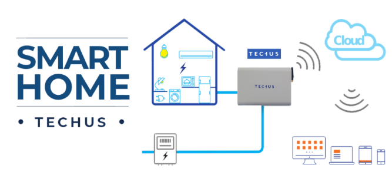

## My Experience in the Energy Sector

Worked for three years and a half for **Energia Mediterranea**:

- Developed from scratch in 4 months, and without any knowledge of Python and Odoo, the whole
Invoicing System for billing of electricity consumption for end-users.
- The framework I've developed was then sold to other 3 energy resellers
- I've applied Continuous Deployment with Jenkins and Amazon EC2 instance, bug fixing, maintaining three different platforms up to date,
refactoring code.
- Collaborated on the smart grid project helping a lot with the integration between the smart meters
reading and the ERP.
- Developed the API in Python and Django, used to retrieve information from the Smart Grid database
using MySQL stored procedure, foreign data wrappers and tables.

### _Project Energy Invoicing System using Odoo as ERP_

**Summary**

I started as Python Developer helping Ener.Med to start doing its energy invoices using an ERP
instead of Word and Excel, and now, after three years, the architecture and the services are used by
three other partners.

**Responsibilities**

I created Python modules.   These modules are installed as features in the Odoo ERP core for
managing clients, contracts, and invoices. 

Every Company had a **Dev** and a **Production** environment,and I maintain all of them,   
keeping all systems up-to-date. 

When needed I prepared a new instance. 
I analysed requirements, indicating the solutions for every new feature requested
- fixing of the  bugs
- refactoring of the code during development life cycle.

Occasionally there was another programmer, I helped her to understand the architecture 
and how modules and features were divided, in order to let the system grow in a flexible way.
Technologies

I created Jenkins tasks and build them in a Continuous Integration environment.

I used Redmine to write technical wiki and documentation and keep track of features and bugs and git
for version control.

I used Amazon Web Services such as S3, EC2, RDS.

### _Project  Smartgrid_ (https://www.techus.it/prodotti/techus-home/)

A parallel Ener.Med project was the SmartGrid. 

It was a net of smartmeters installed in the house of the energy client;
they send every 15 minutes the meter reading that is the consumption in kWh.

**Responsibilities**

- To Maintain and develop API used to retrieve information from the Smartgrid database (MySQL)
- To add new stored procedures and wrappers between databases to link data and requests from the
different Odoo installations and user websites.
- To maintain and add new functionalities to the website used by the end users.

**Technologies**
- APIs are made in Python and Django, as well as the API's configurations between the consumers of
the services. 
- Authentication between end-points is made using oAuth2.
- Sites used by final customers are made using Drupal.
- PostgreSQL stored procedure, Foreign Data Wrappers, and Foreign Data Tables to make the link
to the smartgrid database that contains meter readings from smartmeters.

**Tech stack**

- Python
- Odoo ERP
- AWS Management
- Jenkins
- Linux Script
- ETL scripts
- CI
- MySQL
- DynamoDB
- Django
- API
- PostgreSQL Foreign Tables.